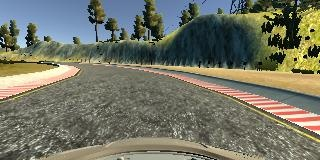
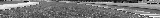
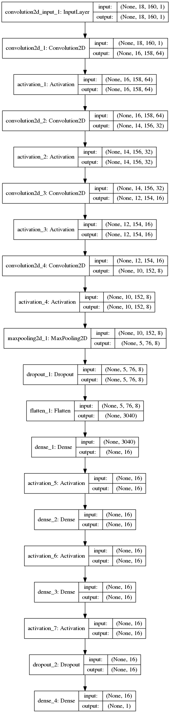
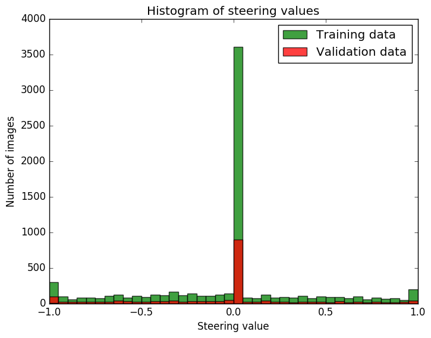

# BehavioralCloning-CarSteering

Behavioral cloning project for Udacity Self-Driving Nanodegree. Neural net that drives the car.

- **model.py** - The script used to create and train the model.
- **drive.py** - The script to drive the car.
- **model.json** - The model architecture.
- **model.h5** - The model weights.
- **README.md** - this file

## Input data

Data are exported from 3 simulated cameras: left, center and right. Size of single image from one each camera is **320 x 160 x 3**.

Example of input data from all three cameras:


### Preprocessing

I am reducing images height - removing top and bottom and reducing rest by 4. The width is only reduced by 2. I am also reducing the number of channels to one. This approach results in small **18 x 160 x1** images

Raw input from center camera:



Processed input from center camera:



### Data structure

I have created directory named *recordings*. Inside this directory I create directory for each training set. Directories are named with the track number and trial number.
```
recordings/
├── track0_trail0
├── track0_trail1
```
Inside of directory with trial recordings there are *driving_log.csv* with image names, steering angle, throttle, break and speed.
```
track0_trail0
├── driving_log.csv
└── IMG
    ├── center_2016_12_30_12_45_27_062.jpg
    ├── center_2016_12_30_12_45_27_181.jpg
    ├── center_2016_12_30_12_45_27_295.jpg
    ...
    ├── left_2016_12_30_12_45_27_062.jpg
    ├── left_2016_12_30_12_45_27_181.jpg
    ├── left_2016_12_30_12_45_27_295.jpg
    ...
    ├── right_2016_12_30_12_45_27_062.jpg
    ├── right_2016_12_30_12_45_27_181.jpg
    ├── right_2016_12_30_12_45_27_295.jpg
    ...
```
First 3 lines of *driving_log.csv*: (There are actually global paths...)
```
track0_trail0/IMG/center_2016_12_30_12_45_27_062.jpg, track0_trail0/IMG/left_2016_12_30_12_45_27_062.jpg, track0_trail0/IMG/right_2016_12_30_12_45_27_062.jpg, 0, 0, 0, 8.181675E-05
track0_trail0/IMG/center_2016_12_30_12_45_27_181.jpg, track0_trail0/IMG/left_2016_12_30_12_45_27_181.jpg, track0_trail0/IMG/right_2016_12_30_12_45_27_181.jpg, 0, 0, 0, 8.170124E-05
track0_trail0/IMG/center_2016_12_30_12_45_27_295.jpg, track0_trail0/IMG/left_2016_12_30_12_45_27_295.jpg, track0_trail0/IMG/right_2016_12_30_12_45_27_295.jpg, 0, 0, 0, 8.189175E-05
```
Here are names for columns (not provided in *driving_log.csv*)
```
Center image, Left image, Right image, Steering Angle, Throttle, Break, Speed
```

## Model

I am using four convolutions with Relu activation. After convolutions there is max pooling and dropout to reduce overfitting.

The fully connected part starts here with flatten. There are three fully connected layers with Relu activation followed by dropout and fully connected output layer.

Layers depths are shown below in *Architecture* on a graph generated by Keras.

### Architecture



### Overfitting reduction

I am reducing overfitting in two ways:

- by adding 2 dropout layers - I was increasing dropout ratio (decreasing parameter)
- by using images from left and right camera as well
- by using max pooling to reduce dimensionality

### Training dataset

I have recorded few datasets and choosed relatively small one recorded without pad (keyboard steering -100%,0,100%)

[](https://www.youtube.com/watch?v=3LHpZjVAvwQ)

Histogram of steering values based on training and validation dataset




## Usage examples

### Visualize input data while training

```
./model.py --show_input 1
```

### Change train/val dataset csv file

```
./model.py --training_csv TRAIN.csv --validation_csv VAL.csv
```

### Number of epochs and batch Size

```
./model.py --epochs 50 --batch_size 128
```

### Drive the car using trained model

```
./drive.py model.json
```

## Results

The model from repository is trained using following command:
```
./model.py --epochs 10 --batch_size 400
```

The result is shown in this video:

[](https://www.youtube.com/watch?v=n87tdEUEMYk)
