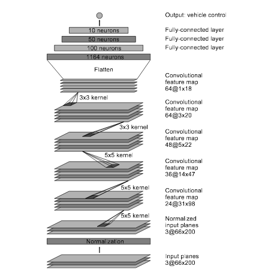

# BehavioralCloning-CarSteering

Behavioral cloning project for Udacity Self-Driving Nanodegree. Neural net that drives the car.

- **model.py** - The script used to create and train the model.
- **drive.py** - The script to drive the car.
- **model.json** - The model architecture.
- **model.h5** - The model weights.
- **README.md** - this file

## Input data

Data are exported from 3 simulated cameras: left, center and right. Size of single image from one each camera is **320 x 160 x 3**.

Example of input data from all three cameras:


### Data processing

I am reducing images height - removing top and bottom lines and reducing by 4. The width is only reduced by 2. I am also reducing the number of channels to one. This approach results in small **18 x 160 x1** images


Raw input from center camera:


```
160 x 320 x3  ==>  18 x 160 x 1
```
Processed input from center camera:


### Data structure

I have created directory named *recordings*. Inside this directory I create directory for each training set. Directories are named with the track number and trial number.
```
recordings/
├── track0_trail0
├── track0_trail1
```
Inside of directory with trial recordings there are *driving_log.csv* with image names, steering angle, throttle, break and speed.
```
track0_trail0
├── driving_log.csv
└── IMG
    ├── center_2016_12_30_12_45_27_062.jpg
    ├── center_2016_12_30_12_45_27_181.jpg
    ├── center_2016_12_30_12_45_27_295.jpg
    ...
    ├── left_2016_12_30_12_45_27_062.jpg
    ├── left_2016_12_30_12_45_27_181.jpg
    ├── left_2016_12_30_12_45_27_295.jpg
    ...
    ├── right_2016_12_30_12_45_27_062.jpg
    ├── right_2016_12_30_12_45_27_181.jpg
    ├── right_2016_12_30_12_45_27_295.jpg
    ...
```
First 3 lines of *driving_log.csv*: (There are actually global paths...)
```
track0_trail0/IMG/center_2016_12_30_12_45_27_062.jpg, track0_trail0/IMG/left_2016_12_30_12_45_27_062.jpg, track0_trail0/IMG/right_2016_12_30_12_45_27_062.jpg, 0, 0, 0, 8.181675E-05
track0_trail0/IMG/center_2016_12_30_12_45_27_181.jpg, track0_trail0/IMG/left_2016_12_30_12_45_27_181.jpg, track0_trail0/IMG/right_2016_12_30_12_45_27_181.jpg, 0, 0, 0, 8.170124E-05
track0_trail0/IMG/center_2016_12_30_12_45_27_295.jpg, track0_trail0/IMG/left_2016_12_30_12_45_27_295.jpg, track0_trail0/IMG/right_2016_12_30_12_45_27_295.jpg, 0, 0, 0, 8.189175E-05
```
Here are names for columns (not provided in *driving_log.csv*)
```
Center image, Left image, Right image, Steering Angle, Throttle, Break, Speed
```

## Model

I am using four convolutions with Relu activation. After convolutions there is max pooling and dropout to reduce overfitting.

The fully connected part starts here with flatten. There are three fully connected layers with Relu activation followed by dropout and fully connected output layer.


### Architecture design

I have studied [NVIDIA model architecture from End to end learning for self-driving cars](https://images.nvidia.com/content/tegra/automotive/images/2016/solutions/pdf/end-to-end-dl-using-px.pdf)
where model from image below was presented:

[](https://images.nvidia.com/content/tegra/automotive/images/2016/solutions/pdf/end-to-end-dl-using-px.pdf)

I have seen work of Vivek Yadav presented in [this blog post](https://chatbotslife.com/learning-human-driving-behavior-using-nvidias-neural-network-model-and-image-augmentation-80399360efee)

I have started with 4 convolutions and 3 fully connected layers and of course one output fully connected layer. I have used Relu activation.
The results was not satisfying so I have added two dropout layers and I have tuned parameters.

### Architecture Characteristics

The final architecture is shown in image and quick table summary below. It uses convolution layer widths 64, 32, 16 and 8. It is increased number of parameters compared to Yadav work, but I am using also larger input images. Fully connected layers have width set to 16.

Table presents layers with their parameters.

Layer type | input | output
-----------|-------|-------
Convolution|18x160 x 1 | 16x158 x 64
Convolution|16x158 x 64| 14x156 x 32
Convolution|14x156 x 32| 12x154 x 16
Convolution|12x154 x 16| 10x152 x 8
Max pooling|10x152 x 8| 5x76 x 8
Dropout  0.3|5x76 x 8|5x76 x 8
Flatten    |5x76 x 8   | 3040
Fully connected|3040|16
Fully connected|16|16
Fully connected|16|16
Dropout  0.3|16|16
Fully connected|16|1

Layers depths are shown below in *Architecture* on a graph generated by Keras.


### Training

#### Overfitting reduction

I am reducing overfitting in two ways:

- by adding 2 dropout layers - I was increasing dropout ratio (decreasing parameter)
- by using images from left and right camera as well
- by using max pooling to reduce dimensionality

The resulting model is able to generalize using relatively small input dataset.

### Training dataset

I have recorded few datasets and choosed relatively small one recorded without pad (keyboard steering -100%,0,100%)

[](https://www.youtube.com/watch?v=3LHpZjVAvwQ)

Histogram of steering values based on training and validation dataset


## Usage examples

### Visualize input data while training

```
./model.py --show_input 1
```

### Change train/val dataset csv file

```
./model.py --training_csv TRAIN.csv --validation_csv VAL.csv
```

### Number of epochs and batch Size

```
./model.py --epochs 50 --batch_size 128
```

### Drive the car using trained model

```
./drive.py model.json
```

## Results

The model from repository is trained using following command:
```
./model.py --epochs 10 --batch_size 400
```

The result is shown in this video:

[](https://www.youtube.com/watch?v=n87tdEUEMYk)
