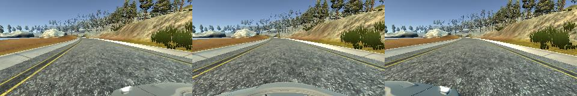

# BehavioralCloning-CarSteering
Behavioral cloning project for Udacity Self-Driving Nanodegree. Neural net that drives the car.

## Input data

Data are exported from 3 simulated cameras: left, center and right. Size of single image from one each camera is 320x160.

Example of input data:

